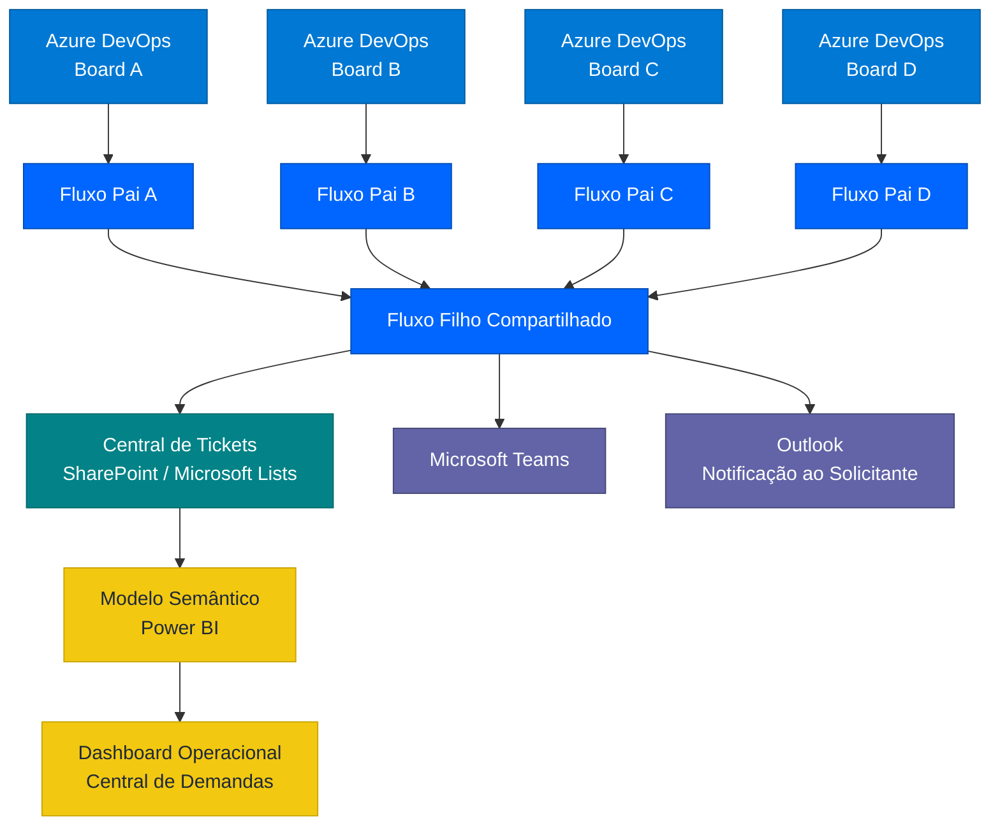
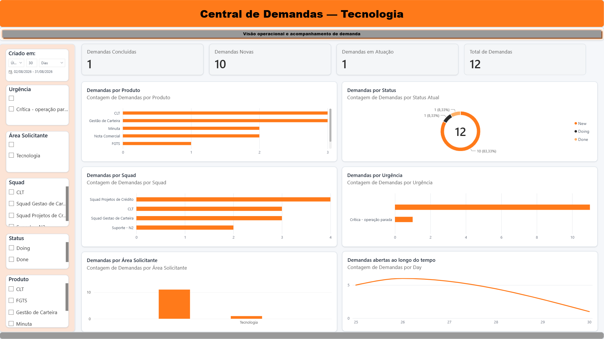
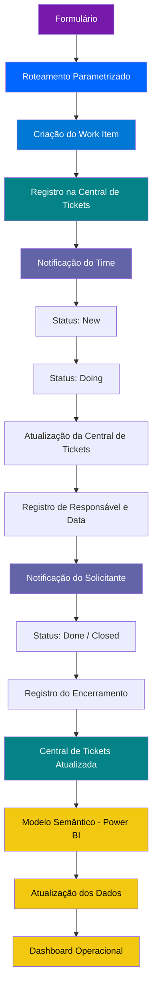

# 🚀 Central de Demandas de Tecnologia

> Case técnico de automação, integração, orquestração e observabilidade de demandas de Tecnologia.

# 💡 Solução desenvolvida para centralizar e automatizar o ciclo de vida de demandas de Tecnologia, desde a abertura da solicitação até o acompanhamento operacional por indicadores.

A arquitetura integra **Microsoft Forms, Power Automate, SharePoint / Microsoft Lists, Azure DevOps, Microsoft Teams, Outlook e Power BI**, permitindo:

- Padronização da entrada de solicitações;
- Roteamento automático para diferentes produtos, squads e boards;
- Criação dinâmica de Work Items no Azure DevOps;
- Comunicação automática com solicitantes e equipes responsáveis;
- Sincronização das principais transições do ciclo de atendimento;
- Centralização dos dados operacionais em uma base estruturada;
- Monitoramento das demandas por meio de dashboards no Power BI.

A solução foi estruturada com foco em **baixo acoplamento, rastreabilidade, parametrização, escalabilidade e observabilidade operacional**.

> 🔐 **Nota de segurança:** este repositório apresenta uma versão demonstrativa e sanitizada da arquitetura. Dados corporativos, credenciais, identificadores sensíveis, URLs internas e informações de usuários ou clientes não fazem parte deste projeto.

---

## 🎯 Problema

O processo de abertura e acompanhamento de demandas de Tecnologia pode envolver diferentes produtos, squads e boards, aumentando a dependência de conhecimento operacional para identificar corretamente qual time deve receber cada solicitação.

Além do roteamento, existia a necessidade de estruturar todo o ciclo de atendimento, garantindo rastreabilidade desde a abertura da demanda até sua conclusão.

Os principais desafios identificados foram:

- Padronizar a entrada das solicitações;
- Reduzir direcionamentos e atividades manuais;
- Direcionar automaticamente cada demanda para o squad e board responsável;
- Manter o solicitante informado durante o atendimento;
- Centralizar informações das demandas em uma única base operacional;
- Registrar responsáveis, status e datas relevantes do atendimento;
- Acompanhar as principais transições do ciclo de vida dos Work Items;
- Transformar os dados operacionais em indicadores para acompanhamento das demandas;
- Disponibilizar uma visão consolidada para análise por produto, squad, status, urgência, área solicitante e período.

A solução foi desenvolvida para reduzir essas dependências operacionais através de uma arquitetura integrada e parametrizada, conectando o processo de entrada, roteamento, atendimento, rastreabilidade e observabilidade das demandas.

---

# 🏗️ Arquitetura da Solução

A solução conecta diferentes componentes do ecossistema Microsoft para formar um fluxo único de atendimento:



### Visão geral da solução


A arquitetura separa **entrada, configuração, processamento, gestão do atendimento e comunicação**, reduzindo o acoplamento entre as diferentes etapas.

---

# 📊 Dashboard Operacional — Power BI

A Central de Tickets também funciona como fonte consolidada para a camada analítica da solução.

Os dados estruturados no SharePoint / Microsoft Lists são consumidos por um **modelo semântico no Power BI**, permitindo transformar as informações geradas durante o ciclo de atendimento em indicadores operacionais.

O dashboard permite acompanhar:

- Volume total de demandas;
- Demandas novas, em atuação e concluídas;
- Distribuição por produto;
- Distribuição por squad;
- Distribuição por status;
- Demandas por nível de urgência;
- Demandas por área solicitante;
- Evolução das demandas ao longo do tempo;
- Análise interativa através de filtros por diferentes dimensões.

A atualização dos dados é realizada de forma agendada, mantendo a camada analítica sincronizada periodicamente com a Central de Tickets.

### Visão operacional



> 🔐 Os dados apresentados na evidência foram utilizados exclusivamente para demonstração da arquitetura, sem exposição de informações corporativas sensíveis.

---

# 🔀 Roteamento parametrizado

Uma das principais decisões arquiteturais foi evitar que todas as regras de roteamento ficassem diretamente acopladas ao fluxo principal.

Em vez de manter diversas condições dentro do Power Automate para determinar manualmente o destino de cada produto, foi criada uma **tabela de configuração no SharePoint**.

Entre os parâmetros que podem fazer parte do roteamento estão:

- Produto;
- Projeto de destino;
- Time responsável;
- Tipo de Work Item;
- Area Path;
- Iteration Path;
- E-mail do time;
- Identificação da equipe;
- Identificação do canal de comunicação;
- Status da configuração.

Durante a execução, o Power Automate consulta essa tabela e utiliza os parâmetros retornados para determinar dinamicamente o destino da solicitação.

### Exemplo visual do roteamento


Essa abordagem permite incorporar novos produtos e destinos com menor impacto sobre os processos existentes.

Em vez de alterar toda a automação, uma parte relevante da configuração passa a ser mantida na camada de dados.

---

# ⚙️ Criação dinâmica do Work Item

Após identificar o roteamento correspondente ao produto selecionado, a automação utiliza os parâmetros recuperados para criar o Work Item no projeto correto do Azure DevOps.

Informações como:

- Projeto;
- Time;
- Tipo de item;
- Título;
- Descrição;
- Produto;
- Solicitante;
- Prioridade;
- Contexto da demanda;

podem ser preenchidas automaticamente.

### Fluxo de criação


O identificador retornado pelo Azure DevOps também é utilizado como referência para as etapas seguintes da automação.

---

# 🔗 Identificação e rastreabilidade

Cada demanda criada recebe um identificador do Azure DevOps.

Esse `WorkItemId` é utilizado como **chave de correlação** entre o Work Item e o registro correspondente na Central de Tickets.

Exemplo conceitual:

```text
WorkItemId: 12345
Produto: Produto Exemplo
Projeto: Squad Exemplo
StatusAtual: Doing
ResponsavelAtual: Usuário Exemplo
DataInicioAtendimento: 2026-08-26 14:30
LinkCard: https://dev.azure.com/example/...
```

Dessa forma, uma atualização ocorrida no Azure DevOps pode ser relacionada ao registro correto armazenado no SharePoint sem depender do título ou de outros campos que podem ser alterados.

---

# 📊 Central de Tickets

A **Central de Tickets** funciona como uma camada centralizada de acompanhamento das demandas.

Ela não representa apenas um histórico de abertura.

Após a criação do Work Item, alterações relevantes em seu ciclo de vida são processadas pelas automações e refletidas na lista.

Entre as informações armazenadas estão:

- Work Item ID;
- Produto;
- Projeto;
- Tipo da demanda;
- Título;
- Protocolo;
- Solicitante;
- E-mail do solicitante;
- Status atual;
- Responsável atual;
- Data de início do atendimento;
- Data de encerramento;
- Responsável no encerramento;
- Link direto para o Work Item.

### Visão da Central de Tickets


A lista passa a funcionar como uma **base viva de acompanhamento**, sendo atualizada conforme o Work Item evolui no Azure DevOps.

---

# 🔄 Ciclo de vida da demanda

A solução acompanha os principais estados do atendimento.

| Estado | Comportamento |
|---|---|
| `New` | Registra a abertura da demanda e seu Work Item |
| `Doing` | Registra início do atendimento e responsável atual |
| `Done / Closed` | Registra conclusão, data e responsável pelo encerramento |

## New

Quando a demanda é criada:

- O Work Item é registrado;
- O protocolo é armazenado;
- O projeto responsável é registrado;
- O produto é identificado;
- O link do card é armazenado;
- O status inicial é definido;
- O solicitante recebe a confirmação da abertura;
- O time responsável é notificado.

## Doing

Quando o atendimento é iniciado:

- `StatusAtual` é atualizado;
- `ResponsavelAtual` é registrado;
- `DataInicioAtendimento` é armazenada;
- O solicitante pode ser informado automaticamente sobre o início do atendimento.

A data de início é registrada na transição para o estado de atendimento e preservada posteriormente.

## Done / Closed

Quando o atendimento é encerrado:

- `StatusAtual` recebe o estado final;
- `DataEncerramento` é registrada;
- `ResponsavelClosed` identifica o responsável no encerramento;
- As informações registradas anteriormente são preservadas;
- Uma comunicação de encerramento pode ser enviada.

---

# 🔄 Processamento das atualizações

As alterações dos Work Items são processadas por uma camada compartilhada responsável por consultar os dados atuais, identificar a transição realizada e executar as ações correspondentes.


O processamento considera informações como:

```text
Estado anterior
      │
      ▼
Estado atual
      │
      ▼
WorkItemId
      │
      ▼
Localização do registro
      │
      ▼
Regra correspondente ao estado
      │
      ├── Doing
      │
      ├── Done
      │
      └── Closed
      │
      ▼
Atualização da Central de Tickets
      │
      ▼
Comunicação
```

Essa camada evita duplicação de regras e concentra comportamentos comuns das diferentes squads.

---

# 🔄 Atualizações incrementais

Uma característica importante da implementação é que as atualizações realizadas durante o ciclo de vida são **incrementais**.

Cada transição modifica somente as informações relacionadas àquele momento do atendimento.

```text
NEW
│
├── WorkItemId
├── Produto
├── Projeto
├── Solicitante
└── StatusAtual
        │
        ▼
DOING
│
├── StatusAtual
├── ResponsavelAtual
└── DataInicioAtendimento
        │
        ▼
DONE / CLOSED
│
├── StatusAtual
├── ResponsavelClosed
└── DataEncerramento
```

Os demais campos permanecem preservados.

Essa abordagem reduz atualizações desnecessárias e evita sobrescrever informações históricas que já haviam sido registradas.

---

# 🧩 Arquitetura dos Fluxos

A arquitetura utiliza uma separação entre os fluxos responsáveis por monitorar diferentes boards do Azure DevOps e uma camada compartilhada responsável pelo processamento das atualizações do ciclo de vida das demandas.

Cada board possui seu próprio fluxo de captura de eventos, enquanto as regras comuns de processamento permanecem centralizadas em um fluxo compartilhado.
lo processamento das atualizações.

```text
Board Projetos de Crédito ──────┐
Board Gestão de Carteira ───────┤
Board CLT ──────────────────────┤
Board Cessão / Regulatórios ────┼──► Fluxo Filho Compartilhado
Board Suporte N2 ───────────────┘             │
                                              ├──► Central de Tickets
                                              │        │
                                              │        └──► Power BI
                                              │               │
                                              │               └──► Dashboard Operacional
                                              │
                                              ├──► Microsoft Teams
                                              │
                                              └──► E-mail ao Solicitante
```

Essa abordagem permite incorporar novos destinos reutilizando a lógica comum já existente.

Um novo board pode possuir seu próprio fluxo de captura de eventos e continuar utilizando a mesma camada compartilhada de processamento.

---

## 🏦 Projetos de Crédito


---

## 📋 Gestão de Carteira


---

## 💼 CLT


---

## 📑 Cessão / Regulatórios


---

## 🛠️ Suporte N2


---

# 📢 Comunicação automática

A solução também automatiza a comunicação entre o processo de atendimento e os usuários envolvidos.

As notificações ocorrem em diferentes momentos do ciclo da demanda.

## ✉️ Abertura

Após a criação da solicitação, o usuário recebe:

- Confirmação da abertura;
- Número do protocolo;
- Informações principais da demanda;
- Produto;
- Tipo de demanda;
- Link para acompanhamento.

### Exemplo


---

## 👨‍💻 Início do atendimento

Quando um responsável assume a demanda e o Work Item entra no estado de atendimento, uma nova comunicação pode ser disparada.


---

## ✅ Encerramento

Ao concluir o atendimento, o fluxo identifica o estado final e pode comunicar automaticamente o encerramento da solicitação.


---

# 📣 Comunicação com as squads

Além da comunicação com o solicitante, a automação direciona notificações aos canais responsáveis no Microsoft Teams.

Isso permite que a mesma arquitetura seja utilizada por diferentes equipes sem centralizar todas as notificações em um único canal.

### Projetos de Crédito


### Gestão de Carteira


### CLT


### Cessão / Regulatórios


### Suporte N2


---

# 🧠 Decisões de Arquitetura

As principais decisões foram tomadas buscando reduzir acoplamento, facilitar a manutenção e permitir que a solução evolua sem concentrar todas as responsabilidades em um único fluxo.

## 1. Roteamento parametrizado fora do fluxo principal

As configurações responsáveis por relacionar produtos, projetos, squads e destinos são mantidas separadamente da lógica principal da automação.

**Benefício:** novos destinos podem ser incorporados com menor necessidade de alteração na lógica central, reduzindo acoplamento e simplificando a manutenção.

---

## 2. WorkItemId como chave de correlação

O identificador gerado pelo Azure DevOps é armazenado na Central de Tickets e utilizado como referência para localizar posteriormente o registro correspondente durante as atualizações do ciclo de vida.

**Benefício:** cria uma correlação consistente entre Azure DevOps e SharePoint sem depender de títulos, nomes ou outras informações mutáveis.

---

## 3. Separação entre captura e processamento

Cada board monitorado possui uma camada responsável pela captura dos eventos, enquanto as regras comuns são executadas por um fluxo compartilhado.

```text
Captura do Evento
       │
       ▼
Fluxo específico do Board
       │
       ▼
Processamento Compartilhado
```

**Benefício:** reutilização da lógica, redução de duplicidade e facilidade para expansão da solução para novos boards.

---

## 4. Processamento orientado a estado

A automação interpreta as principais transições do Work Item para determinar quais ações devem ser executadas.

Exemplos:

```text
New → Doing
Doing → Done / Closed
```

Cada mudança de estado pode atualizar informações específicas da Central de Tickets e disparar as comunicações correspondentes.

**Benefício:** permite acompanhar automaticamente a evolução da demanda durante seu ciclo de atendimento.

---

## 5. Atualizações incrementais

Durante cada etapa do ciclo, somente os campos relacionados ao evento atual são modificados.

Informações registradas anteriormente são preservadas sempre que não fazem parte da atualização em processamento.

**Benefício:** preservação do histórico operacional e redução do risco de sobrescrita desnecessária de informações.

---

## 6. Central de Tickets como fonte operacional consolidada

As informações relevantes provenientes dos diferentes fluxos são sincronizadas em uma estrutura central utilizando SharePoint / Microsoft Lists.

A Central de Tickets mantém dados como:

- Identificação da demanda;
- Produto;
- Squad;
- Área solicitante;
- Status atual;
- Responsável pelo atendimento;
- Datas do ciclo de vida;
- Urgência;
- Referência ao Work Item;
- Link para acesso ao card no Azure DevOps.

**Benefício:** criação de uma visão centralizada e estruturada das demandas, independentemente do board responsável pelo atendimento.

---

## 7. Separação entre camada operacional e camada analítica

O Power BI não depende diretamente dos diferentes boards do Azure DevOps para construção dos indicadores.

A **Central de Tickets atua como fonte consolidada de dados**, enquanto o Power BI é responsável pela camada de modelagem e visualização.

```text
Azure DevOps
     │
     ▼
Power Automate
     │
     ▼
Central de Tickets
     │
     ▼
Modelo Semântico
     │
     ▼
Power BI
     │
     ▼
Dashboard Operacional
```

Essa separação permite que a automação seja responsável pelo processamento e persistência dos dados, enquanto a camada analítica permanece focada na transformação dessas informações em indicadores.

**Benefício:** menor acoplamento entre a origem transacional e a camada de visualização, além de facilitar a evolução independente do dashboard.

---

## 8. Modelo semântico e atualização automatizada dos indicadores

Os dados consolidados na Central de Tickets são consumidos pelo modelo semântico do Power BI e utilizados na construção do dashboard operacional.

A atualização dos dados é executada de forma agendada, permitindo que novos registros e alterações realizadas no processo sejam refletidos periodicamente nos indicadores.

**Benefício:** acompanhamento recorrente da operação sem necessidade de consolidação manual dos dados.

---

# 🛠️ Tecnologias Utilizadas

| Tecnologia | Utilização |
|---|---|
| **Microsoft Power Automate** | Orquestração dos processos, roteamento e sincronização do ciclo de vida |
| **Microsoft Forms** | Entrada padronizada das solicitações |
| **SharePoint / Microsoft Lists** | Parametrização do roteamento e persistência da Central de Tickets |
| **Azure DevOps Boards** | Gestão e acompanhamento dos Work Items |
| **Power BI** | Modelagem, indicadores e dashboard operacional |
| **Microsoft Teams** | Notificação e comunicação com os times responsáveis |
| **Outlook** | Comunicação automatizada com os solicitantes |
| **REST APIs** | Consulta e integração de informações entre serviços |
| **JSON** | Estruturação e manipulação de payloads |
| **OData** | Filtros e consultas sobre dados estruturados |

---

# 🧪 Validação Ponta a Ponta

A solução foi validada através de testes ponta a ponta, cobrindo desde a abertura da solicitação até a disponibilização dos dados para acompanhamento operacional no Power BI.

Os testes contemplaram o roteamento da demanda, criação e atualização do Work Item, sincronização da Central de Tickets, notificações automáticas e atualização dos indicadores do dashboard.



Os testes também foram utilizados durante a evolução da arquitetura para garantir que novos produtos e destinos pudessem ser incorporados sem interromper os fluxos existentes.

---

# 📈 Resultados

A implementação proporcionou:

- ✅ Centralização da entrada de demandas;
- ✅ Padronização das informações recebidas;
- ✅ Roteamento automático para diferentes times;
- ✅ Redução da necessidade de direcionamento manual;
- ✅ Criação automática de Work Items;
- ✅ Comunicação automática com solicitantes;
- ✅ Comunicação automática com as squads;
- ✅ Rastreabilidade do ciclo de vida das demandas;
- ✅ Registro de responsáveis;
- ✅ Registro de início do atendimento;
- ✅ Registro do encerramento;
- ✅ Central de Tickets atualizada conforme o estado do Azure DevOps;
- ✅ Menor acoplamento entre configuração e processamento;
- ✅ Facilidade para incorporar novos produtos e boards;
- ✅ Integração da Central de Tickets com o Power BI;
- ✅ Dashboard operacional para acompanhamento das demandas;
- ✅ Indicadores por status, produto, squad, urgência e área solicitante;
- ✅ Atualização agendada dos dados através do modelo semântico.

---

# 🚧 Desafios técnicos

Durante a implementação foram trabalhados diferentes cenários relacionados à integração entre plataformas, incluindo:

- Manipulação de payloads JSON;
- Referências entre ações do Power Automate;
- Processamento de atualizações do Azure DevOps;
- Identificação dinâmica de projetos e boards;
- Diferenciação entre IDs internos do SharePoint e `WorkItemId`;
- Consultas OData;
- Atualização incremental de registros;
- Tratamento de estados do Work Item;
- Identificação do responsável atual;
- Registro do responsável no encerramento;
- Integração com canais do Microsoft Teams;
- Preservação de dados durante atualizações;
- Organização entre fluxos específicos e processamento compartilhado;
- Evolução da solução sem interromper rotas existentes.

---

## 🛡️ Governança

Outras evoluções possíveis:

- Estratégia centralizada de tratamento de exceções;
- Reprocessamento automático;
- Auditoria de alterações;
- Governança das conexões utilizadas pelas automações;
- Documentação operacional;
- Expansão para novos produtos;
- Expansão para novas squads.

---

# 🔐 Segurança e privacidade

Este repositório representa um **case técnico da arquitetura**.

Não fazem parte deste repositório:

- Credenciais;
- Tokens;
- Secrets;
- Identificadores de tenant;
- IDs internos sensíveis;
- E-mails corporativos;
- Informações de clientes;
- Informações de operações;
- URLs privadas;
- Dados pessoais;
- Configurações produtivas sensíveis;
- Exports produtivos contendo informações internas.

As evidências apresentadas possuem finalidade exclusivamente demonstrativa.

---

# 📁 Estrutura do repositório

```text
central-demandas-tecnologia/
│
├── README.md
│
└── docs/
    │
    ├── arquitetura-geral.png
    ├── roteamento-sharepoint.png
    ├── criacao-workitem.png
    ├── central-tickets.png
    │
    ├── Central de Demandas - Processar Atualização Work Item.png
    │
    ├── Central de Demandas Projetos de Crédito.png
    ├── Central de Demandas Gestão de Carteira.png
    ├── Central demandas CLT.png
    ├── Central de Demandas Cessão Regulatorios.png
    ├── Central de Demandas Suporte N2.png
    │
    ├── Central de Demandas Notificação Email.png
    ├── Central de Demandas Notificação Status em Atendimento.png
    ├── Central de Demandas Notificação Status Done.png
    │
    ├── Central de Demandas Canal Squad Proj Credito.png
    ├── Central de Demandas Canal Squad Gestão Carteira.png
    ├── Central de Demandas Canal Squad CLT.png
    ├── Central de Demandas Canal Squad Cessão Regulatorios.png
    └── Central de Demandas Canal Squad Suporte N2.png
```

---

# 📚 Principais aprendizados

O desenvolvimento desta solução envolveu mais do que automatizar tarefas isoladas.

O projeto exigiu decisões relacionadas a:

- Integração entre diferentes plataformas;
- Modelagem do ciclo de vida de uma demanda;
- Arquitetura de automações;
- Parametrização;
- Desacoplamento;
- Rastreabilidade;
- Comunicação automática;
- Persistência de estados;
- Troubleshooting;
- Integração via APIs;
- Evolução incremental de uma solução em funcionamento.

Um dos principais aprendizados foi estruturar a automação para que **novos destinos e regras pudessem ser incorporados com o menor impacto possível sobre os processos já existentes**.

---

# 👨‍💻 Sobre o projeto

Este projeto é apresentado como um **case de engenharia, integração e automação de processos**, demonstrando a aplicação prática de conceitos de:

- Arquitetura de soluções;
- Integração de sistemas;
- Automação de processos;
- Sustentação;
- Troubleshooting;
- DevOps;
- Rastreabilidade;
- Melhoria contínua.

O objetivo deste repositório é documentar as decisões técnicas, arquitetura e aprendizados obtidos durante a construção da solução, utilizando somente informações adequadas para exposição pública.

---

> **Central de Demandas de Tecnologia** — automação do ciclo de vida de demandas, da entrada ao encerramento.
