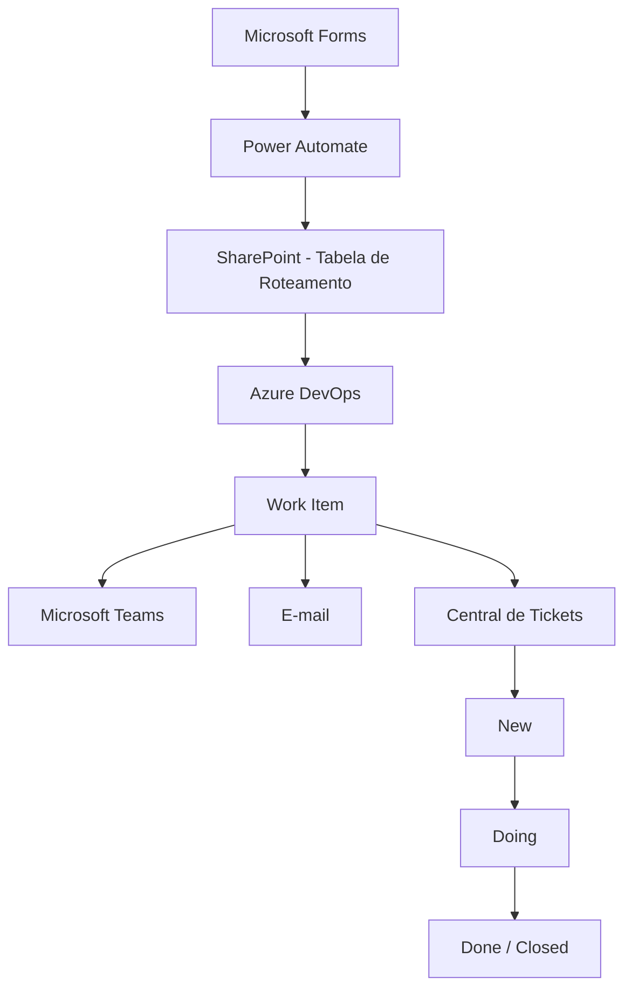

# Central de Demandas de Tecnologia

> Case técnico de automação, integração e orquestração de demandas.

Solução desenvolvida para centralizar a abertura, o roteamento automático
e o acompanhamento do ciclo de vida de demandas de Tecnologia.

## Arquitetura

   
## 🎯 Problema

O processo de abertura e direcionamento de demandas de Tecnologia
envolvia diferentes produtos, squads e boards, aumentando a dependência
de conhecimento operacional para identificar corretamente o time responsável.

A solução foi desenvolvida para centralizar essa entrada e automatizar
o roteamento das solicitações de acordo com parâmetros previamente configurados.

## 💡 Solução

A Central de Demandas utiliza uma camada de roteamento parametrizada para
identificar o destino de cada solicitação.

Após o envio de uma demanda:

1. O formulário recebe os dados da solicitação.
2. O Power Automate consulta a configuração de roteamento.
3. O Work Item é criado no projeto e squad correspondentes no Azure DevOps.
4. O solicitante recebe a confirmação e o protocolo.
5. O time responsável é notificado.
6. A demanda é registrada na Central de Tickets.
7. Alterações no ciclo de vida do Work Item atualizam automaticamente
   o registro central.

## 🔄 Ciclo de vida

| Estado | Comportamento |
|---|---|
| `New` | Registra a abertura da demanda |
| `Doing` | Registra responsável e início do atendimento |
| `Done / Closed` | Registra conclusão, data e responsável pelo encerramento |

## 🛠️ Tecnologias

- Microsoft Power Automate
- Microsoft Forms
- SharePoint / Microsoft Lists
- Azure DevOps Boards
- Microsoft Teams
- Outlook
- REST APIs
- JSON
- OData

## 🧠 Decisões de Arquitetura

### Roteamento parametrizado

Uma das principais decisões da solução foi evitar que as regras de
roteamento ficassem diretamente acopladas ao fluxo principal.

Em vez de manter múltiplas condições para determinar o destino de cada
produto, foi criada uma tabela de configuração responsável por armazenar
os parâmetros necessários para o direcionamento das demandas.

Entre os parâmetros utilizados estão:

- Produto
- Projeto de destino
- Time responsável
- Tipo de Work Item
- Area Path
- Iteration Path
- Identificação do time
- Identificação do canal de comunicação
- Status da configuração

O Power Automate consulta essa configuração durante a execução e utiliza
os dados retornados para determinar dinamicamente o destino da solicitação.

Essa abordagem reduz o acoplamento entre regra de negócio e automação,
facilita a manutenção e permite incorporar novos produtos e destinos
com menor impacto sobre os fluxos existentes.

## 🔄 Sincronização com o Azure DevOps

A Central de Tickets não funciona apenas como histórico de abertura.

Alterações relevantes no Work Item são processadas pela automação e
refletidas na base central de acompanhamento.

### New

O ticket é registrado após sua criação no Azure DevOps.

### Doing

Ao iniciar o atendimento, são atualizados:

- Status atual
- Responsável atual
- Data de início do atendimento

### Done / Closed

No encerramento, são registrados:

- Status final
- Responsável no encerramento
- Data de encerramento

As atualizações são incrementais, preservando as informações registradas
nas etapas anteriores do ciclo de vida.
