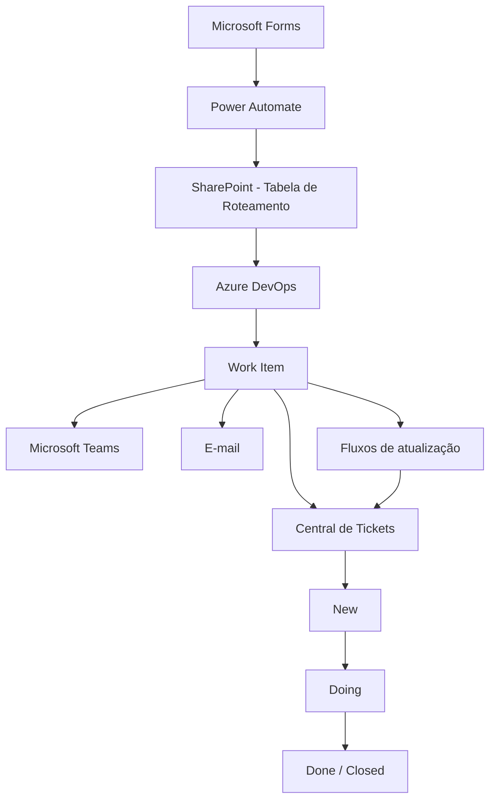
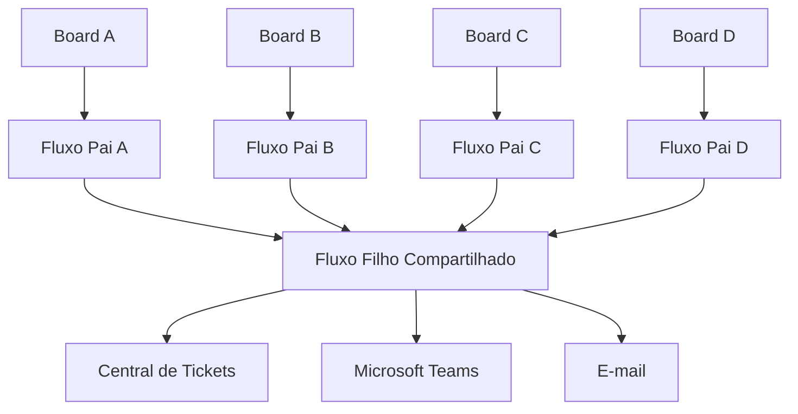

# 🚀 Central de Demandas de Tecnologia

> **Case técnico de automação, integração e orquestração de demandas.**

Solução desenvolvida para centralizar a abertura, o roteamento automático e o acompanhamento do ciclo de vida de demandas de Tecnologia, integrando **Microsoft Forms, Power Automate, SharePoint, Azure DevOps, Microsoft Teams e Outlook**.

> 🔐 **Nota de segurança:** este repositório apresenta uma versão demonstrativa e sanitizada da arquitetura. Dados corporativos, credenciais, identificadores, URLs internas e informações de usuários ou clientes não fazem parte deste projeto.

---

## 🎯 Problema

O processo de abertura e direcionamento de demandas de Tecnologia pode envolver diferentes produtos, squads e boards, aumentando a dependência de conhecimento operacional para identificar corretamente qual time deve receber cada solicitação.

Além do roteamento, também existia a necessidade de manter o solicitante informado durante o atendimento e criar uma visão centralizada do ciclo de vida das demandas.

A solução foi desenvolvida para centralizar essa entrada e automatizar o direcionamento das solicitações utilizando parâmetros previamente configurados.

---

## 💡 Solução

A **Central de Demandas de Tecnologia** utiliza uma camada de roteamento parametrizada para identificar dinamicamente o destino de cada solicitação.

Após o envio de uma demanda:

1. O formulário recebe e padroniza os dados da solicitação.
2. O Power Automate consulta a tabela de roteamento.
3. O produto selecionado determina projeto, time, tipo de Work Item e demais parâmetros.
4. O Work Item é criado automaticamente no Azure DevOps.
5. O solicitante recebe a confirmação e o protocolo da demanda.
6. O time responsável é notificado no Microsoft Teams.
7. A solicitação é registrada na Central de Tickets.
8. Alterações relevantes no Work Item são sincronizadas com a Central.
9. O solicitante recebe novas comunicações conforme o atendimento evolui.

---

## 🏗️ Arquitetura



### Visão geral da solução


---

## 🔀 Roteamento parametrizado

Uma das principais decisões arquiteturais foi evitar que as regras de roteamento ficassem diretamente acopladas ao fluxo principal.

Em vez de manter diversas condições dentro do Power Automate para determinar manualmente o destino de cada produto, foi criada uma **tabela de configuração no SharePoint**.

Entre os parâmetros que podem fazer parte do roteamento estão:

* Produto
* Projeto de destino
* Time responsável
* Tipo de Work Item
* Area Path
* Iteration Path
* E-mail do time
* Identificação da equipe
* Identificação do canal de comunicação
* Status da configuração

Durante a execução, o Power Automate consulta essa tabela e utiliza os parâmetros retornados para determinar dinamicamente o destino da solicitação.

Isso permite adicionar novos produtos e destinos com menor impacto sobre os processos existentes.

### Exemplo visual do roteamento


---

## ⚙️ Criação dinâmica do Work Item

Após identificar o roteamento correspondente ao produto selecionado, a automação utiliza os parâmetros recuperados para criar o Work Item no projeto correto do Azure DevOps.

Informações como projeto, time, tipo de item, título, descrição, solicitante, prioridade e contexto da demanda podem ser preenchidas automaticamente.

O identificador retornado pelo Azure DevOps também é utilizado como referência para as etapas seguintes da automação.

### Fluxo de criação


---

## 🔗 Identificação e rastreabilidade

Cada demanda criada recebe um identificador do Azure DevOps.

Esse `WorkItemId` é utilizado como chave de correlação entre o Work Item e o registro correspondente na Central de Tickets.

Exemplo conceitual:

```text
WorkItemId: 12345
Produto: Produto Exemplo
Projeto: Squad Exemplo
StatusAtual: Doing
ResponsavelAtual: Usuário Exemplo
DataInicioAtendimento: 2026-08-26 14:30
LinkCard: https://dev.azure.com/example/...
```

Dessa forma, uma atualização ocorrida no Azure DevOps pode ser relacionada ao registro correto armazenado no SharePoint.

---

## 📊 Central de Tickets

A **Central de Tickets** funciona como uma camada centralizada de acompanhamento das demandas.

Ela não representa apenas um histórico de abertura.

Após a criação do Work Item, alterações relevantes em seu ciclo de vida são processadas pelas automações e refletidas na lista.

Entre as informações armazenadas estão:

* Work Item ID
* Produto
* Projeto
* Tipo da demanda
* Título
* Solicitante
* Status atual
* Responsável atual
* Data de início do atendimento
* Data de encerramento
* Responsável no encerramento
* Link direto para o Work Item

### Visão da Central de Tickets


---

## 🔄 Ciclo de vida da demanda

A solução acompanha os principais estados do atendimento.

| Estado          | Comportamento                                            |
| --------------- | -------------------------------------------------------- |
| `New`           | Registra a abertura da demanda e seu Work Item           |
| `Doing`         | Registra início do atendimento e responsável atual       |
| `Done / Closed` | Registra conclusão, data e responsável pelo encerramento |

### New

Quando a demanda é criada:

* O Work Item é registrado.
* O protocolo é armazenado.
* O projeto responsável é registrado.
* O link do card é armazenado.
* O status inicial é definido.
* O solicitante recebe a confirmação da abertura.
* O time responsável é notificado.

### Doing

Quando o atendimento é iniciado:

* `StatusAtual` é atualizado.
* `ResponsavelAtual` é registrado.
* `DataInicioAtendimento` é armazenada.
* O solicitante pode ser informado sobre o início do atendimento.

A data de início é registrada na transição para o estado de atendimento, preservando o histórico posteriormente.

### Done / Closed

Quando o atendimento é encerrado:

* `StatusAtual` recebe o estado final.
* `DataEncerramento` é registrada.
* `ResponsavelClosed` identifica o responsável no encerramento.
* As informações registradas anteriormente são preservadas.
* O encerramento pode gerar novas notificações.

### Representação do ciclo


---

## 🔄 Atualizações incrementais

Uma característica importante da implementação é que as atualizações realizadas durante o ciclo de vida são **incrementais**.

Cada transição atualiza somente as informações relacionadas àquele momento do atendimento.

Exemplo:

```text
NEW
│
├── WorkItemId
├── Produto
├── Projeto
├── Solicitante
└── StatusAtual
        │
        ▼
DOING
│
├── StatusAtual
├── ResponsavelAtual
└── DataInicioAtendimento
        │
        ▼
DONE / CLOSED
│
├── StatusAtual
├── ResponsavelClosed
└── DataEncerramento
```

Isso reduz atualizações desnecessárias e ajuda a preservar as informações já registradas.

---

## 🧩 Arquitetura de fluxos

A solução utiliza uma separação entre fluxos responsáveis por observar diferentes boards e uma camada compartilhada responsável pelo processamento das atualizações.



Essa abordagem permite incorporar novos destinos reutilizando a lógica comum já existente.

Um novo board pode possuir seu próprio fluxo de captura de eventos e continuar utilizando a mesma camada compartilhada de processamento.

### Estrutura dos fluxos


---

## 📢 Comunicação automática

A solução também automatiza a comunicação entre o processo de atendimento e os usuários envolvidos.

As notificações podem ocorrer em diferentes momentos.

### Abertura

O solicitante recebe:

* Confirmação da solicitação
* Número do protocolo
* Informações principais da demanda
* Link para acompanhamento

O time responsável recebe uma notificação no Microsoft Teams.

### Início do atendimento

Quando um responsável assume a demanda, o solicitante pode ser informado automaticamente.

### Encerramento

Ao concluir o atendimento, uma nova comunicação pode informar o encerramento da solicitação.

### Exemplo de notificação


---

## 🧠 Decisões de Arquitetura

### 1. Roteamento fora do fluxo principal

As configurações de destino são mantidas separadamente da lógica principal da automação.

**Benefício:** menor acoplamento e manutenção simplificada.

### 2. WorkItemId como chave de correlação

O identificador do Azure DevOps é armazenado na Central de Tickets e utilizado para localizar posteriormente o registro relacionado.

**Benefício:** sincronização entre diferentes plataformas sem depender do título ou de outras informações mutáveis.

### 3. Separação entre captura e processamento

Diferentes boards podem possuir fluxos responsáveis por capturar suas atualizações enquanto uma camada compartilhada processa as regras comuns.

**Benefício:** reutilização e expansão da solução.

### 4. Atualização orientada a estado

A automação reage às principais transições do Work Item.

**Benefício:** rastreabilidade do ciclo de atendimento.

### 5. Atualizações incrementais

Somente os dados relacionados à etapa atual são modificados.

**Benefício:** preservação do histórico e menor risco de sobrescrita desnecessária.

---

## 🛠️ Tecnologias utilizadas

* **Microsoft Power Automate** — orquestração e automação dos processos
* **Microsoft Forms** — entrada padronizada das solicitações
* **SharePoint / Microsoft Lists** — configuração de roteamento e Central de Tickets
* **Azure DevOps Boards** — gestão dos Work Items e atendimento técnico
* **Microsoft Teams** — comunicação com os times responsáveis
* **Outlook** — comunicação com os solicitantes
* **REST APIs** — integração e consulta de informações
* **JSON** — manipulação de payloads
* **OData** — filtros e consultas aos registros

---

## 🧪 Validação

A solução foi validada através de testes ponta a ponta envolvendo diferentes etapas do processo:

```text
Formulário
    ↓
Roteamento
    ↓
Criação do Work Item
    ↓
Registro na Central de Tickets
    ↓
Notificação do time
    ↓
New → Doing
    ↓
Atualização da Central
    ↓
Notificação do solicitante
    ↓
Doing → Done / Closed
    ↓
Registro do encerramento
```

Os testes também foram utilizados durante a evolução da arquitetura para garantir que novos produtos e destinos pudessem ser incorporados sem interromper os fluxos existentes.

---

## 📈 Resultados

A implementação proporcionou:

* Centralização da entrada de demandas
* Padronização das informações recebidas
* Roteamento automático para diferentes times
* Redução da necessidade de direcionamento manual
* Criação automática de Work Items
* Comunicação automática com solicitantes e times
* Rastreabilidade do ciclo de vida das demandas
* Registro de responsáveis e datas de atendimento
* Base centralizada para acompanhamento
* Menor acoplamento entre configuração e processamento
* Facilidade para incorporar novos produtos e boards
* Estrutura preparada para geração futura de indicadores

---

## 🚧 Desafios técnicos

Durante a implementação foram trabalhados diferentes cenários relacionados à integração entre plataformas, incluindo:

* Manipulação de payloads JSON
* Referências entre ações do Power Automate
* Processamento de atualizações do Azure DevOps
* Identificação dinâmica de projetos e boards
* Diferenciação entre IDs internos do SharePoint e WorkItemId
* Atualização incremental de registros
* Tratamento de estados do Work Item
* Integração com canais do Microsoft Teams
* Preservação de dados durante atualizações
* Organização entre fluxos específicos e processamento compartilhado
* Evolução da solução sem interrupção das rotas existentes

---

## 📊 Possibilidades futuras

A estrutura atual cria uma base para novas evoluções.

### Observabilidade

* Registro centralizado de falhas
* Monitoramento das execuções
* Identificação de etapas com erro
* Estratégias de retry e reprocessamento

### Indicadores

A partir das datas registradas, podem ser calculadas métricas como:

**Tempo até início do atendimento**

```text
DataInicioAtendimento - DataAbertura
```

**Tempo total de resolução**

```text
DataEncerramento - DataAbertura
```

**Tempo efetivo em atendimento**

```text
DataEncerramento - DataInicioAtendimento
```

### Dashboards

Os dados estruturados podem futuramente alimentar dashboards contendo:

* Volume de demandas
* Demandas por produto
* Demandas por time
* Distribuição por status
* Tempo médio de atendimento
* Tempo médio de resolução
* Indicadores de SLA

### Governança

Outras evoluções possíveis:

* Estratégia centralizada de tratamento de exceções
* Reprocessamento automático
* Auditoria de alterações
* Governança das conexões utilizadas pelas automações
* Documentação operacional
* Expansão para novos produtos e squads

---

## 🔐 Segurança e privacidade

Este repositório representa um **case técnico da arquitetura**.

Não fazem parte deste repositório:

* Credenciais
* Tokens
* Secrets
* Identificadores de tenant
* IDs internos de equipes ou canais
* E-mails corporativos
* Informações de clientes
* Informações de operações
* URLs privadas
* Dados pessoais
* Configurações produtivas sensíveis
* Exports produtivos contendo informações internas


---

## 📁 Estrutura do repositório

```text
central-demandas-tecnologia/
│
├── README.md
│
└── docs/
    ├── arquitetura-geral.png
    ├── roteamento-sharepoint.png
    ├── criacao-workitem.png
    ├── central-tickets.png
    ├── ciclo-vida-ticket.png
    ├── arquitetura-fluxos.png
    └── notificacao-teams.png
```

---

## 📚 Principais aprendizados

O desenvolvimento desta solução envolveu mais do que automatizar tarefas isoladas.

O projeto exigiu decisões relacionadas a:

* Integração entre diferentes plataformas
* Modelagem do ciclo de vida de uma demanda
* Parametrização
* Desacoplamento
* Rastreabilidade
* Comunicação automática
* Persistência de estados
* Troubleshooting
* Evolução incremental de uma solução em funcionamento

Um dos principais aprendizados foi estruturar a automação para que novos destinos e regras pudessem ser incorporados com o menor impacto possível sobre os processos já existentes.

---

## 👨‍💻 Sobre o projeto

Este projeto é apresentado como um **case de engenharia e automação de processos**, demonstrando a aplicação de conceitos de integração, arquitetura, sustentação e melhoria contínua utilizando o ecossistema Microsoft.

O objetivo do repositório é documentar as decisões técnicas e os aprendizados obtidos durante a construção da solução, utilizando somente informações adequadas para exposição pública.
