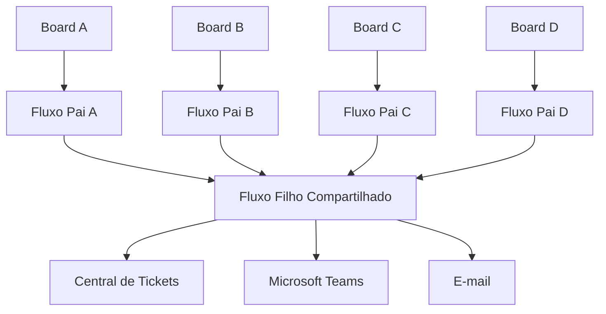
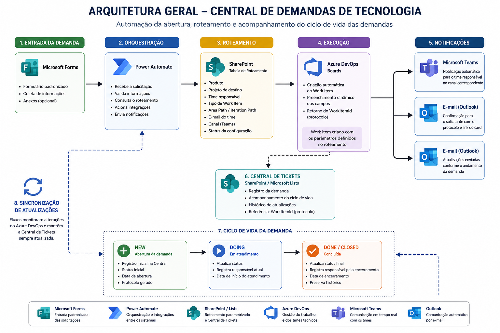
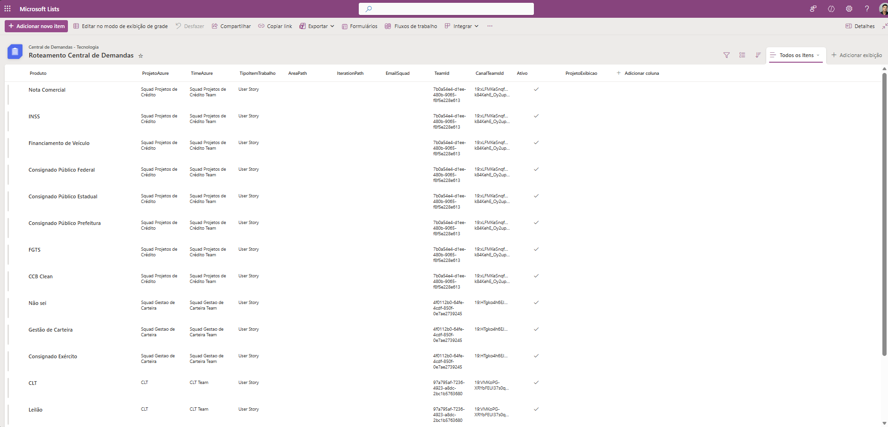
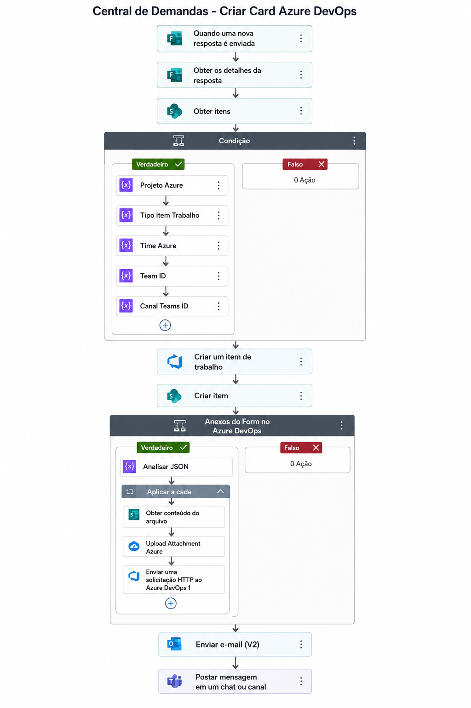
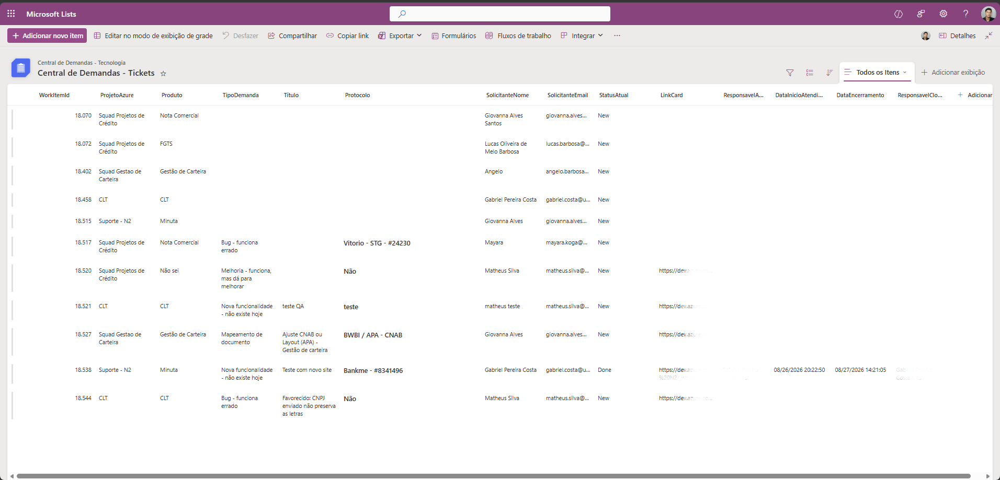
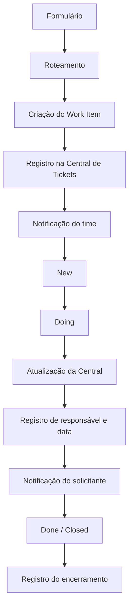

# 🚀 Central de Demandas de Tecnologia

> **Case técnico de automação, integração e orquestração de demandas.**

Solução desenvolvida para centralizar a abertura, o roteamento automático e o acompanhamento do ciclo de vida de demandas de Tecnologia, integrando **Microsoft Forms, Power Automate, SharePoint, Azure DevOps, Microsoft Teams e Outlook**.

> 🔐 **Nota de segurança:** este repositório apresenta uma versão demonstrativa e sanitizada da arquitetura. Dados corporativos, credenciais, identificadores sensíveis, URLs internas e informações de usuários ou clientes não fazem parte deste projeto.

---

## 🎯 Problema

O processo de abertura e direcionamento de demandas de Tecnologia pode envolver diferentes produtos, squads e boards, aumentando a dependência de conhecimento operacional para identificar corretamente qual time deve receber cada solicitação.

Além do roteamento, também existia a necessidade de:

- Padronizar a entrada das solicitações;
- Reduzir direcionamentos manuais;
- Manter o solicitante informado durante o atendimento;
- Centralizar informações das demandas;
- Registrar responsáveis e datas importantes;
- Acompanhar o ciclo de vida dos Work Items;
- Criar uma base estruturada para indicadores futuros.

A solução foi desenvolvida para centralizar essa entrada e automatizar o direcionamento das solicitações utilizando parâmetros previamente configurados.

---

# 💡 Solução

A **Central de Demandas de Tecnologia** utiliza uma camada de roteamento parametrizada para identificar dinamicamente o destino de cada solicitação.

Após o envio de uma demanda:

1. O formulário recebe e padroniza os dados da solicitação;
2. O Power Automate consulta a tabela de roteamento;
3. O produto selecionado determina projeto, time, tipo de Work Item e demais parâmetros;
4. O Work Item é criado automaticamente no Azure DevOps;
5. O identificador gerado é utilizado como protocolo e chave de correlação;
6. O solicitante recebe a confirmação da abertura;
7. O time responsável é notificado no Microsoft Teams;
8. A solicitação é registrada na Central de Tickets;
9. Alterações relevantes no Work Item são processadas;
10. A Central de Tickets é atualizada de acordo com o estado da demanda;
11. O solicitante recebe novas comunicações conforme o atendimento evolui.

---

# 🏗️ Arquitetura

A solução conecta diferentes componentes do ecossistema Microsoft para formar um fluxo único de atendimento:



### Visão geral da solução



A arquitetura separa **entrada, configuração, processamento, gestão do atendimento e comunicação**, reduzindo o acoplamento entre as diferentes etapas.

---

# 🔀 Roteamento parametrizado

Uma das principais decisões arquiteturais foi evitar que todas as regras de roteamento ficassem diretamente acopladas ao fluxo principal.

Em vez de manter diversas condições dentro do Power Automate para determinar manualmente o destino de cada produto, foi criada uma **tabela de configuração no SharePoint**.

Entre os parâmetros que podem fazer parte do roteamento estão:

- Produto;
- Projeto de destino;
- Time responsável;
- Tipo de Work Item;
- Area Path;
- Iteration Path;
- E-mail do time;
- Identificação da equipe;
- Identificação do canal de comunicação;
- Status da configuração.

Durante a execução, o Power Automate consulta essa tabela e utiliza os parâmetros retornados para determinar dinamicamente o destino da solicitação.

### Exemplo visual do roteamento



Essa abordagem permite incorporar novos produtos e destinos com menor impacto sobre os processos existentes.

Em vez de alterar toda a automação, uma parte relevante da configuração passa a ser mantida na camada de dados.

---

# ⚙️ Criação dinâmica do Work Item

Após identificar o roteamento correspondente ao produto selecionado, a automação utiliza os parâmetros recuperados para criar o Work Item no projeto correto do Azure DevOps.

Informações como:

- Projeto;
- Time;
- Tipo de item;
- Título;
- Descrição;
- Produto;
- Solicitante;
- Prioridade;
- Contexto da demanda;

podem ser preenchidas automaticamente.

### Fluxo de criação



O identificador retornado pelo Azure DevOps também é utilizado como referência para as etapas seguintes da automação.

---

# 🔗 Identificação e rastreabilidade

Cada demanda criada recebe um identificador do Azure DevOps.

Esse `WorkItemId` é utilizado como **chave de correlação** entre o Work Item e o registro correspondente na Central de Tickets.

Exemplo conceitual:

```text
WorkItemId: 12345
Produto: Produto Exemplo
Projeto: Squad Exemplo
StatusAtual: Doing
ResponsavelAtual: Usuário Exemplo
DataInicioAtendimento: 2026-08-26 14:30
LinkCard: https://dev.azure.com/example/...
```

Dessa forma, uma atualização ocorrida no Azure DevOps pode ser relacionada ao registro correto armazenado no SharePoint sem depender do título ou de outros campos que podem ser alterados.

---

# 📊 Central de Tickets

A **Central de Tickets** funciona como uma camada centralizada de acompanhamento das demandas.

Ela não representa apenas um histórico de abertura.

Após a criação do Work Item, alterações relevantes em seu ciclo de vida são processadas pelas automações e refletidas na lista.

Entre as informações armazenadas estão:

- Work Item ID;
- Produto;
- Projeto;
- Tipo da demanda;
- Título;
- Protocolo;
- Solicitante;
- E-mail do solicitante;
- Status atual;
- Responsável atual;
- Data de início do atendimento;
- Data de encerramento;
- Responsável no encerramento;
- Link direto para o Work Item.

### Visão da Central de Tickets



A lista passa a funcionar como uma **base viva de acompanhamento**, sendo atualizada conforme o Work Item evolui no Azure DevOps.

---

# 🔄 Ciclo de vida da demanda

A solução acompanha os principais estados do atendimento.

| Estado | Comportamento |
|---|---|
| `New` | Registra a abertura da demanda e seu Work Item |
| `Doing` | Registra início do atendimento e responsável atual |
| `Done / Closed` | Registra conclusão, data e responsável pelo encerramento |

## New

Quando a demanda é criada:

- O Work Item é registrado;
- O protocolo é armazenado;
- O projeto responsável é registrado;
- O produto é identificado;
- O link do card é armazenado;
- O status inicial é definido;
- O solicitante recebe a confirmação da abertura;
- O time responsável é notificado.

## Doing

Quando o atendimento é iniciado:

- `StatusAtual` é atualizado;
- `ResponsavelAtual` é registrado;
- `DataInicioAtendimento` é armazenada;
- O solicitante pode ser informado automaticamente sobre o início do atendimento.

A data de início é registrada na transição para o estado de atendimento e preservada posteriormente.

## Done / Closed

Quando o atendimento é encerrado:

- `StatusAtual` recebe o estado final;
- `DataEncerramento` é registrada;
- `ResponsavelClosed` identifica o responsável no encerramento;
- As informações registradas anteriormente são preservadas;
- Uma comunicação de encerramento pode ser enviada.

---

# 🔄 Processamento das atualizações

As alterações dos Work Items são processadas por uma camada compartilhada responsável por consultar os dados atuais, identificar a transição realizada e executar as ações correspondentes.


O processamento considera informações como:

```text
Estado anterior
      │
      ▼
Estado atual
      │
      ▼
WorkItemId
      │
      ▼
Localização do registro
      │
      ▼
Regra correspondente ao estado
      │
      ├── Doing
      │
      ├── Done
      │
      └── Closed
      │
      ▼
Atualização da Central de Tickets
      │
      ▼
Comunicação
```

Essa camada evita duplicação de regras e concentra comportamentos comuns das diferentes squads.

---

# 🔄 Atualizações incrementais

Uma característica importante da implementação é que as atualizações realizadas durante o ciclo de vida são **incrementais**.

Cada transição modifica somente as informações relacionadas àquele momento do atendimento.

```text
NEW
│
├── WorkItemId
├── Produto
├── Projeto
├── Solicitante
└── StatusAtual
        │
        ▼
DOING
│
├── StatusAtual
├── ResponsavelAtual
└── DataInicioAtendimento
        │
        ▼
DONE / CLOSED
│
├── StatusAtual
├── ResponsavelClosed
└── DataEncerramento
```

Os demais campos permanecem preservados.

Essa abordagem reduz atualizações desnecessárias e evita sobrescrever informações históricas que já haviam sido registradas.

---

# 🧩 Arquitetura dos fluxos

A solução utiliza uma separação entre fluxos responsáveis por observar diferentes boards e uma camada compartilhada responsável pelo processamento das atualizações.

```text
Board Projetos de Crédito ──────┐
Board Gestão de Carteira ───────┤
Board CLT ──────────────────────┤
Board Cessão / Regulatórios ────┼──► Processamento Compartilhado
Board Suporte N2 ───────────────┘             │
                                              ├──► Central de Tickets
                                              ├──► Microsoft Teams
                                              └──► E-mail
```

Essa abordagem permite incorporar novos destinos reutilizando a lógica comum já existente.

Um novo board pode possuir seu próprio fluxo de captura de eventos e continuar utilizando a mesma camada compartilhada de processamento.

---

## 🏦 Projetos de Crédito


---

## 📋 Gestão de Carteira


---

## 💼 CLT


---

## 📑 Cessão / Regulatórios


---

## 🛠️ Suporte N2


---

# 📢 Comunicação automática

A solução também automatiza a comunicação entre o processo de atendimento e os usuários envolvidos.

As notificações ocorrem em diferentes momentos do ciclo da demanda.

## ✉️ Abertura

Após a criação da solicitação, o usuário recebe:

- Confirmação da abertura;
- Número do protocolo;
- Informações principais da demanda;
- Produto;
- Tipo de demanda;
- Link para acompanhamento.

### Exemplo


---

## 👨‍💻 Início do atendimento

Quando um responsável assume a demanda e o Work Item entra no estado de atendimento, uma nova comunicação pode ser disparada.


---

## ✅ Encerramento

Ao concluir o atendimento, o fluxo identifica o estado final e pode comunicar automaticamente o encerramento da solicitação.


---

# 📣 Comunicação com as squads

Além da comunicação com o solicitante, a automação direciona notificações aos canais responsáveis no Microsoft Teams.

Isso permite que a mesma arquitetura seja utilizada por diferentes equipes sem centralizar todas as notificações em um único canal.

### Projetos de Crédito


### Gestão de Carteira


### CLT


### Cessão / Regulatórios


### Suporte N2


---

# 🧠 Decisões de Arquitetura

## 1. Roteamento fora do fluxo principal

As configurações de destino são mantidas separadamente da lógica principal da automação.

**Benefício:** menor acoplamento e manutenção simplificada.

---

## 2. WorkItemId como chave de correlação

O identificador do Azure DevOps é armazenado na Central de Tickets e utilizado para localizar posteriormente o registro relacionado.

**Benefício:** sincronização entre diferentes plataformas sem depender do título ou de outras informações mutáveis.

---

## 3. Separação entre captura e processamento

Diferentes boards possuem fluxos responsáveis por capturar suas atualizações enquanto uma camada compartilhada processa as regras comuns.

**Benefício:** reutilização, manutenção simplificada e expansão da solução.

---

## 4. Atualização orientada a estado

A automação reage às principais transições do Work Item.

**Benefício:** rastreabilidade do ciclo de atendimento.

---

## 5. Atualizações incrementais

Somente os dados relacionados à etapa atual são modificados.

**Benefício:** preservação do histórico e menor risco de sobrescrita desnecessária.

---

## 6. Centralização do acompanhamento

As informações operacionais relevantes são sincronizadas com a Central de Tickets.

**Benefício:** criação de uma fonte estruturada para acompanhamento operacional e geração futura de indicadores.

---

# 🛠️ Tecnologias utilizadas

| Tecnologia | Utilização |
|---|---|
| **Microsoft Power Automate** | Orquestração e automação dos processos |
| **Microsoft Forms** | Entrada padronizada das solicitações |
| **SharePoint / Microsoft Lists** | Roteamento e Central de Tickets |
| **Azure DevOps Boards** | Gestão dos Work Items |
| **Microsoft Teams** | Comunicação com os times |
| **Outlook** | Comunicação com os solicitantes |
| **REST APIs** | Consulta e integração de informações |
| **JSON** | Manipulação de payloads |
| **OData** | Filtros e consultas |

---

# 🧪 Validação

A solução foi validada através de testes ponta a ponta envolvendo diferentes etapas do processo:



Os testes também foram utilizados durante a evolução da arquitetura para garantir que novos produtos e destinos pudessem ser incorporados sem interromper os fluxos existentes.

---

# 📈 Resultados

A implementação proporcionou:

- ✅ Centralização da entrada de demandas;
- ✅ Padronização das informações recebidas;
- ✅ Roteamento automático para diferentes times;
- ✅ Redução da necessidade de direcionamento manual;
- ✅ Criação automática de Work Items;
- ✅ Comunicação automática com solicitantes;
- ✅ Comunicação automática com as squads;
- ✅ Rastreabilidade do ciclo de vida das demandas;
- ✅ Registro de responsáveis;
- ✅ Registro de início do atendimento;
- ✅ Registro do encerramento;
- ✅ Central de Tickets atualizada conforme o estado do Azure DevOps;
- ✅ Menor acoplamento entre configuração e processamento;
- ✅ Facilidade para incorporar novos produtos e boards;
- ✅ Estrutura preparada para geração futura de indicadores.

---

# 🚧 Desafios técnicos

Durante a implementação foram trabalhados diferentes cenários relacionados à integração entre plataformas, incluindo:

- Manipulação de payloads JSON;
- Referências entre ações do Power Automate;
- Processamento de atualizações do Azure DevOps;
- Identificação dinâmica de projetos e boards;
- Diferenciação entre IDs internos do SharePoint e `WorkItemId`;
- Consultas OData;
- Atualização incremental de registros;
- Tratamento de estados do Work Item;
- Identificação do responsável atual;
- Registro do responsável no encerramento;
- Integração com canais do Microsoft Teams;
- Preservação de dados durante atualizações;
- Organização entre fluxos específicos e processamento compartilhado;
- Evolução da solução sem interromper rotas existentes.

---

# 📊 Possibilidades futuras

A estrutura atual cria uma base para novas evoluções.

## 🔍 Observabilidade

- Registro centralizado de falhas;
- Monitoramento das execuções;
- Identificação de etapas com erro;
- Estratégias de retry;
- Reprocessamento de demandas;
- Alertas de falha.

## 📈 Indicadores

A partir das datas registradas, podem ser calculadas métricas como:

### Tempo até início do atendimento

```text
DataInicioAtendimento - DataAbertura
```

### Tempo total de resolução

```text
DataEncerramento - DataAbertura
```

### Tempo efetivo em atendimento

```text
DataEncerramento - DataInicioAtendimento
```

## 📊 Dashboards

Os dados estruturados podem futuramente alimentar dashboards contendo:

- Volume de demandas;
- Demandas por produto;
- Demandas por time;
- Distribuição por status;
- Tempo médio de atendimento;
- Tempo médio de resolução;
- Indicadores de SLA;
- Taxa de demandas concluídas;
- Evolução histórica do volume.

## 🛡️ Governança

Outras evoluções possíveis:

- Estratégia centralizada de tratamento de exceções;
- Reprocessamento automático;
- Auditoria de alterações;
- Governança das conexões utilizadas pelas automações;
- Documentação operacional;
- Expansão para novos produtos;
- Expansão para novas squads.

---

# 🔐 Segurança e privacidade

Este repositório representa um **case técnico da arquitetura**.

Não fazem parte deste repositório:

- Credenciais;
- Tokens;
- Secrets;
- Identificadores de tenant;
- IDs internos sensíveis;
- E-mails corporativos;
- Informações de clientes;
- Informações de operações;
- URLs privadas;
- Dados pessoais;
- Configurações produtivas sensíveis;
- Exports produtivos contendo informações internas.

As evidências apresentadas possuem finalidade exclusivamente demonstrativa.

---

# 📁 Estrutura do repositório

```text
central-demandas-tecnologia/
│
├── README.md
│
└── docs/
    │
    ├── arquitetura-geral.png
    ├── roteamento-sharepoint.png
    ├── criacao-workitem.png
    ├── central-tickets.png
    │
    ├── Central de Demandas - Processar Atualização Work Item.png
    │
    ├── Central de Demandas Projetos de Crédito.png
    ├── Central de Demandas Gestão de Carteira.png
    ├── Central demandas CLT.png
    ├── Central de Demandas Cessão Regulatorios.png
    ├── Central de Demandas Suporte N2.png
    │
    ├── Central de Demandas Notificação Email.png
    ├── Central de Demandas Notificação Status em Atendimento.png
    ├── Central de Demandas Notificação Status Done.png
    │
    ├── Central de Demandas Canal Squad Proj Credito.png
    ├── Central de Demandas Canal Squad Gestão Carteira.png
    ├── Central de Demandas Canal Squad CLT.png
    ├── Central de Demandas Canal Squad Cessão Regulatorios.png
    └── Central de Demandas Canal Squad Suporte N2.png
```

---

# 📚 Principais aprendizados

O desenvolvimento desta solução envolveu mais do que automatizar tarefas isoladas.

O projeto exigiu decisões relacionadas a:

- Integração entre diferentes plataformas;
- Modelagem do ciclo de vida de uma demanda;
- Arquitetura de automações;
- Parametrização;
- Desacoplamento;
- Rastreabilidade;
- Comunicação automática;
- Persistência de estados;
- Troubleshooting;
- Integração via APIs;
- Evolução incremental de uma solução em funcionamento.

Um dos principais aprendizados foi estruturar a automação para que **novos destinos e regras pudessem ser incorporados com o menor impacto possível sobre os processos já existentes**.

---

# 👨‍💻 Sobre o projeto

Este projeto é apresentado como um **case de engenharia, integração e automação de processos**, demonstrando a aplicação prática de conceitos de:

- Arquitetura de soluções;
- Integração de sistemas;
- Automação de processos;
- Sustentação;
- Troubleshooting;
- DevOps;
- Rastreabilidade;
- Melhoria contínua.

O objetivo deste repositório é documentar as decisões técnicas, arquitetura e aprendizados obtidos durante a construção da solução, utilizando somente informações adequadas para exposição pública.

---

> **Central de Demandas de Tecnologia** — automação do ciclo de vida de demandas, da entrada ao encerramento.
